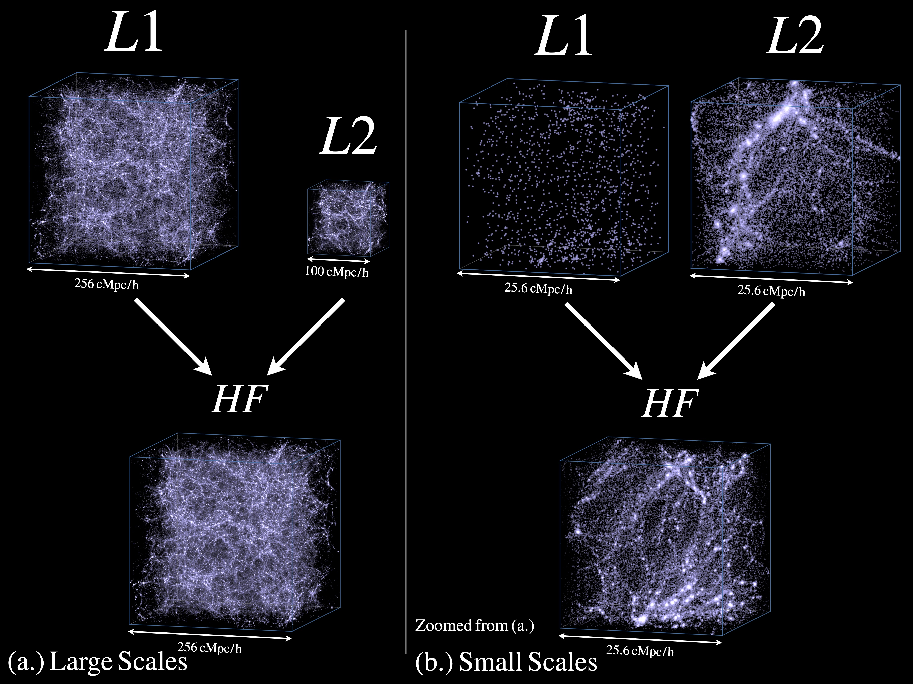

# MFBoxData
Simulation data from
> MF-Box: Multi-fidelity and multi-scale emulation for the matter power spectrum [astro-ph.CO: 2306.03144](https://arxiv.org/abs/2306.03144)  
> *Ming-Feng Ho, Simeon Bird, Martin A. Fernandez, Christian R. Shelton*

We have extended the idea of [multi-fidelity modeling](https://arxiv.org/abs/2105.01081) and developed MF-Box, a method for modeling N-body simulations that incorporates multiple particle loads and physical scales. By using two types of cost-effective simulations, L1 and L2, we construct a model that accurately predicts summary statistics derived from the high-fidelity simulation across a wide range of cosmological parameter space. L1 simulates a low particle load in a large volume, while L2 simulates a low particle load in a small volume. By combining the simulations from different volumes, we achieve precise interpolation in a high-dimensional parameter space across scales, significantly reducing computational costs compared to running an additional high-fidelity simulation. MF-Box is versatile and can be applied to various simulation suites, providing an effective solution for interpolating simulations across multiple physical scales using affordable approximations.

---

Data here include matter power spectra from dark-matter only N-body simulations with different fidelities and boxsizes:

- Format of naming: `dmo_{number of simulations}_res{particle load}box{box size}`
- For example, `dmo_24_res512box256`: 24 simulations in 512^3 particle load and 256 Mpc/h box.

## Parameters

In the `cc_emulator_powerspecs.h5` file:
| Parameter | Explanation |
| --- | --- |
| `bounds` | maximum and minimum limits of the prior volume|
| `hubble` | Hubble parameter, h, which is H0 / (100 km/s/Mpc)|
| `kfmpc`  | k bins of power spectra in h/Mpc |
| `modes`  | number of modes in a given power spectrum bin |
| `ns` | Scalar spectral index |
| `omega0` | Total matter density at z=0 (includes massive neutrinos and baryons) |
| `omegab` | Baryon density|
| `parameter_names` | String names of parameters |
| `params` | Latin-hypercube samples of parameters |
| `powerspecs` | Matter power spectra |
| `scalar_amp` | A_s at k = 0.05, comparable to the Planck value.
| `scale_factors` | Scale factor, 1 / (1 + redshift) |
| `zout` | The redshifts of the simulations |

